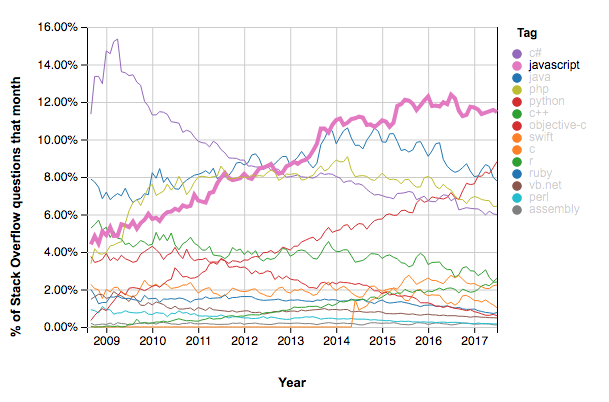
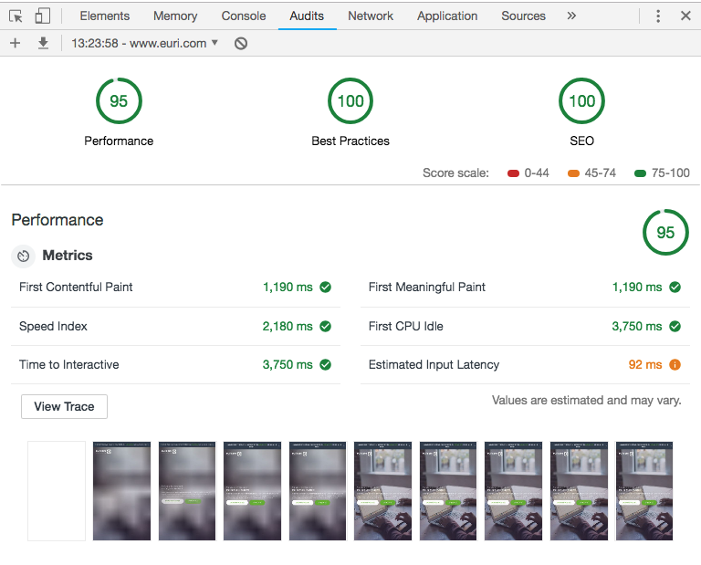

import { Head } from 'mdx-deck'
import { Notes, Image, Appear } from 'mdx-deck'
import { Split, SplitRight } from 'mdx-deck/layouts'
import { FullScreenCode } from 'mdx-deck/layouts'
import { CodeSurfer } from 'mdx-deck-code-surfer'
import nightOwl from 'prism-react-renderer/themes/nightOwl'
// import Appear from './components/Appear'
import { Referer } from './components/Referer'
import { BGImage } from './components/BgImage'

import Layout from './layouts/demo-layout'

export { default as theme } from './theme'

<Head>
  <title>Latest JavaScript Trends 2018</title>
</Head>

# New trends in javascript development (2018)

<br/>


By Peter Cosemans

---

# Javascript the language

<blockquote>Still getting bigger every year</blockquote>

---

## C# vs JavaScript

&nbsp;

<Referer>Statistics from StackOverflow</Referer>

Javascript Is Still One of the Fastest-growing Languages

---

## Expected change in use


---

## Coming soon to JS near you

### ES2018 - ES2019 - TS3.0

- Async/Await
- Promise finally
- Class fields
- Private fields/methods
- Dynamic import
- Numeric separators
- Others...

---

## Async/Await

```js
function getAllUsers() {
  return api.get('api/users').then(res => {
    return res.data;
  });
}
```

```js
function async getAllUsers() {
    const res = await api.get('api/users')
    return res.data;
}
```

---

## Promise Finally

### (ES stage-4, TS2.7)

```js
promise
    .then(result => {···})
    .catch(error => {···})
    .finally(() => {···});
```

---

## Class fields

### (ES stage-3, TS 1.x)

```js
class MyClass {
  state = {
    counter: 0,
  };
  static propTypes = {
    name: PropTypes.String,
  };
}
```

---

## Numeric separators

### (ES stage-2, TS2.7)

```js
const x = 123_234_242;
const y = 123234242;
x === y; // true
```

---

## Private fields/methods

### (ES stage-3, TS ????)

```js
class MyClass {
    #counter = 0;

    gimmTheCount() {
        this.#inc();
        return this.#coounter;
    }

    #inc() { this.#counter++; }
}
```

---

## Optional chaining

### (stage-1, TS ????)

```js
const x = foo && foo.bar ? foo.bar.x : undefined;

const x = foo?.bar?.y;
```

---

# JavaScript Frameworks

<blockquote>Battle of the Giants</blockquote>

---

export default Layout

<BGImage src="./images/audiance.jpeg" />

## What front-end framework are you using?

<br/>
<div style={{fontSize: 70, textAlign: 'left', marginLeft: "50px"}}>
    <Appear>
        <li>AngularJS</li>
        <li>Angular</li>
        <li>React</li>
        <li>VueJS</li>
        <li>Other (or none)</li>
    </Appear>
</div>

---

export default Split


## GitHub Stars

- VueJS: 114k
- React: 111k
- AngularJS: 59k
- Angular: 41k

---

## Npm Downloads


---

## Frameworks Usage - 2017Q4

&nbsp;
&nbsp;


---

## Use & Intrest


- High Intrest 🤔 - VueJS
- Not Use Again 😫 - AngularJS, Backbone & (Angular2)
- Use Again 😀 - React

---

## Poll by Todd Motto


---

# Angular

<div style={{fontSize: 50, textAlign: 'left', marginLeft: "50px"}}>
    <Appear>
        <li>Smaller & faster build</li>
        <li>A new CLI (workspaces, lib, plugins)</li>
        <li>Angular Elements (web components)</li>
        <li>😡 Closed platform</li>
        <li>😡 Breaking changes</li>
        <li>😡 Preview (Ivy, elements) </li>
        <li>Angular 7...</li>
    </Appear>
</div>

```notes
- CLI architecture (Bazel, breaking change, no ng eject, != LernaJS )
- Ivy maybe for v7 (and it's not compatible)
- CLI not really compatible and where is my `ng eject`
- SystemJS -> WebPack -> Bazel (WTF)
- @angular/core split to 418 modules
- Artificial intelligence-based storage that is backwards with the ngrx
- Angular moves away of JavaScript ecosystem
```

---

# VueJS

<div style={{fontSize: 60, textAlign: 'left', marginLeft: "50px"}}>
    <Appear>
        <li>Better dev support (prettier, testing & devTools)</li>
        <li>@vue/cli v3 👏 (faster build & 100% customizable)</li>
        <li>@vue/cli console 👏</li>
        <li>Half the size, double the performance (vNext)</li>
    </Appear>
</div>

---

## @vue/cli - ui (console)


---


---

## VueJS - Productivity

```bash
# create a component
echo '<template><h1>My View App</h1></template>' > hello.vue

# fast prototype
vue serve hello.vue

# create library
vue build --target lib hello.vue
```

---

# React

<blockquote>Gives you Wings</blockquote>

---

# 😍 I Love React 😍 

Simple button component

```js
import React from 'react';

const Button = props => (
  <button className="btn btn-default" {...props}>
    {props.children}
  </button>
);
export default Button;
```

---

# vs Angular

(Not So Simple) Button Component

```js
// button.component.ts
import { Component, Input, Ouput } from '@angular/core';

@Component({
  templateUrl: './button.component.html',
})
export class ButtonComponent {
  @Input()
  type: String;
  @Ouput()
  click = new EventEmitter();

  handleClick(event) {
    this.click.emit(event);
  }
}
```

```js
// button.component.html
<button class="btn btn-default" [type]="type" (click)="handleClick($event)">
    <ng-content></ng-content>
<button>
```

```js
// my.module.ts
import { NgModule } from '@angular/core'
import { ButtonComponent } from './components/button.component'

@NgModule({
    // ...
    declarations: [
        ButtonComponent
    },
    exports: [
        ButtonComponent
    ]
})
```

---

# React

<div style={{fontSize: 60, textAlign: 'left', marginLeft: "50px"}}>
    <Appear>
        <li>Fiber (100% backwards compatible)</li>
        <li>Faster Server Side Rendering</li>
        <li>Fragments, Portals & Error bounderies </li>
        <li>Async rendering & Suspense 😍 (vNext)</li>
        <li>https://build-mbfootjxoo.now.sh/</li>
    </Appear>
</div>

---

# GraphQL

GraphQL: The next generation of API design


---

## Usage of GraphQL

- Facebook
- Github, Amazon
- KLM
- PayPal
- AirBnb
- EggHead & Medium
- Pintrest
- IBM
- Walmart, Shopify & Starbucks
- American Express
- Sitecore, ContentFull, DatoCMS, WordPress, ...
- Microsoft ??? (next to Github)
- [...](https://graphql.org/users/)

---

## Solutions for/of GraphQL

<div style={{fontSize: 60, textAlign: 'left', marginLeft: "50px"}}>
    <Appear>
        <li>Headless CMS</li>
        <li>Client & Server libraries</li>
        <li>Managed Services</li>
        <li>New: Subscriptions, Stitching, ...</li>
    </Appear>
</div>

```notes
- Headless CMS (GraphCMS, wpgraphql, DataCMS, SiteCore, Mozaik, ...)
- Client libraries (Apollo Client, AWS Amplify, urql, ...)
- Server libraries (Apollo Server, Yoga, Prisma, ...)
- Managed Services (GraphCool, AWS AppSync, Apollo Engine)
- Platforms (JS, ruby, java, elixir, dotNet, php, python)
- New (Subscriptions, stitching, code generation)
```

[GraphQL Stack](https://www.graphqlstack.com/)

---

## Apollo Client


[Reducing our Redux code with React Apollo](https://blog.apollographql.com/reducing-our-redux-code-with-react-apollo-5091b9de9c2a)

---

export default FullScreenCode

## Apollo Client Sample

```js
import gql from 'graphql-tag';
import { graphql } from 'react-apollo';

const GET_DOGS_QUERY = gql`{
    dogs {
        id
        breed
    }
}`;

@graphql(GET_DOGS_QUERY)
const Dogs = ({ onDogSelected, data: { loading, dogs, error } }) => {
  if (loading) return 'Loading...';
  if (error) return `Error! ${error.message}`;
  return (
    <ul>{dogs.map(dog => <li key={dog.id}>{dog.breed}</li>)}</ul>
  );
};
```

---

# Performance matters

For any web application


---

## Lets test ...

---

## ordina.be


---

## www.vente-exclusive.com


---

## euri.com ?

---

## euri.com 👏 



---

# Client Side, Server Side <br/> and Pre-rendering

Render what, where, ...?

---


---


Improve SEO and noticeable performance.

```notes
You need nodeJS on the server to render.
```

---

## Server Side Render (SSR)

<br/>
<div style={{fontSize: 60, textAlign: 'left'}}>
    <Appear>
        <li>Angular Universal 😥</li>
        <li>Next.js 7 - React SSR Done Right</li>
        <li>Nuxt 2 - Universal Vue.js Apps</li>
    </Appear>
</div>

---

## Pre-rendering

App is rendered at build time

<br/>
<div style={{fontSize: 60, textAlign: 'left'}}>
    <Appear>
        <li>Jekyll & Hugo</li>
        <li>VuePress - Vue Static Site Generator</li>
        <li>Gatsby - 🚀 Blazing fast site generator</li>
    </Appear>
</div>

---

## Gatsby


---

# Web-Components

The building blocks of the future

---

## Web-Components


```notes
The building blocks
- HTML Templates and slots
- Shadow Dom
- Custom elements (extend HTML)
```

---

## Creating Web Components

<br/>
<div style={{fontSize: 70, textAlign: 'left'}}>
    <Appear>
        <li>(NOT YET) Angular Elements</li>
        <li>Polymer Library v3</li>
        <li>Ionic StencilJS</li>
        <li>VueJS</li>
    </Appear>
</div>

```notes
Ionic v4 is build with Stencil
```

---

export default FullScreenCode

## StencilJS

```js
import { Component, Prop } from '@stencil/core';

@Component({
  tag: 'my-first-component',
  styleUrl: 'my-first-component.scss',
})
export class MyComponent {
  @Prop()
  name: string;
  render() {
    return <p>My name is {this.name}</p>;
  }
}
```

---

## VueJS

```html
<template>
   <p>prop value: {{myProp}}</p>
</template>
<script>
export default { props: ['myProp'] };
</script>
```

Any vue component can be exported as web-component

```bash
# create web-component
vue build ./src/components/Sample.vue --target wc --name my-sample
```

---

## VueJS

Use

```html
<html>
    <head>
        <title>my-sample demo</title>
        <script src="https://unpkg.com/vue"></script>
        <script src="./my-sample.js"></script>
    </head>
    <body>
        <my-sample prop="hello"></my-sample>
    </body>
</html>
```

---

export default Layout

<BGImage src="./images/audiance.jpeg" />

## What testing framework are you using?

<br/>
<div style={{fontSize: 80, textAlign: 'left', marginLeft: '50px'}}>
    <Appear>
        <li>None</li>
        <li>Karma/Jasmine</li>
        <li>Mocha/Chai/Sinon</li>
        <li>Jest 🙂</li>
        <li>StoryBook 😍</li>
    </Appear>
</div>

---

## Jest is the rising star


- Default on React project
- Preferred on VueJS projects
- Snapshot testing is awesome

---


## Storybook is your new friend

- Component Driven Development
- Component Library
- Visual Component Development & Testing
- Documentation
- Available for: Angular, React, VueJS, Polymer, HTML/CSS

[Live Sample - React](https://release-3-4--storybooks-official.netlify.com/?knob-Text=Submit&selectedKind=Components%7CForm%2FButton&selectedStory=with%20onclick&full=0&addons=1&stories=1&panelRight=0&addonPanel=storybook%2Fstories%2Fstories-panel)
[Live Sample - Angular](https://release-3-4--storybooks-angular.netlify.com/?selectedKind=Button&selectedStory=with%20text&full=0&addons=1&stories=1&panelRight=0&addonPanel=storybook%2Fstories%2Fstories-panel)

---

export default Layout

<BGImage src="./images/audiance.jpeg" />

## What e2e test framework are you using?

<br/>
<div style={{fontSize: 70, textAlign: 'left', marginLeft: '50px'}}>
    <Appear>
        <li>None</li>
        <li>Protractor (angular)</li>
        <li>Nightwatch</li>
        <li>Puppeteer</li>
        <li>TestCafe</li>
        <li>Cypress 🙂</li>
    </Appear>
</div>

---


- Fast, easy and reliable testing
- Watch and Auto reload
- Time travel
- For anything that runs in a browser

[Cypress](https://www.cypress.io/)

---

## Cypress at Twitter


---

export default Layout

<BGImage src="./images/audiance.jpeg" />

## Where do you deploy your app's

<br/>
<div style={{fontSize: 60, textAlign: 'left', marginLeft: '50px'}}>
    <Appear>
        <li>Virtual Machine (AWS, Azure, Google)</li>
        <li>Docker</li>
        <li>App Engine (Heroku, Azure, AWS, Google)</li>
        <li>Other</li>
        <li>Zeit Now (quick and easy) 🙂 </li>
        <li>Netlify (for static content) 🙂 </li>
    </Appear>
</div>

---

## NodeJS Survey


---


[Now](https://zeit.co/now)

---


<br/>
<div style={{fontSize: 70, textAlign: 'left', marginLeft: '50px'}}>
    <Appear>
        <li>CDN Hosting</li>
        <li>HTTPS is automatic</li>
        <li>Full cache control</li>
        <li>Automate build & deployment</li>
        <li>Identity, Functions, Forms</li>
        <li>Low pricing strategy</li>
    </Appear>
</div>

[Netlify](https://www.netlify.com/)

---

# Honorable Mentions

<br/>
<div style={{fontSize: 70, textAlign: 'left', marginLeft: '50px'}}>
    <Appear>
        <li>DateFns (a modern date library)</li>
        <li>Babel 7.0 & TypeScript 3.0</li>
        <li>PWA</li>
        <li>WebPack 4.x</li>
        <li>Capacitor (replaces Cordova)</li>
        <li>React Native (still strong)</li>
        <li>Flutter ( vs React Native)</li>
    </Appear>
</div>

```notes
- Babel: Release 7 starts with a big cleanup, ready for the future
```

---

# Thank You 👋 

### [https://mjr-javascript-trends-2018-hnmmmyahqt.now.sh](https://mjr-javascript-trends-2018-hnmmmyahqt.now.sh)

---

### Credits

```jsx
Built with MDX Deck
```

<div style={{ height: 20}}></div>

```jsx
Deployed on now.sh
```
