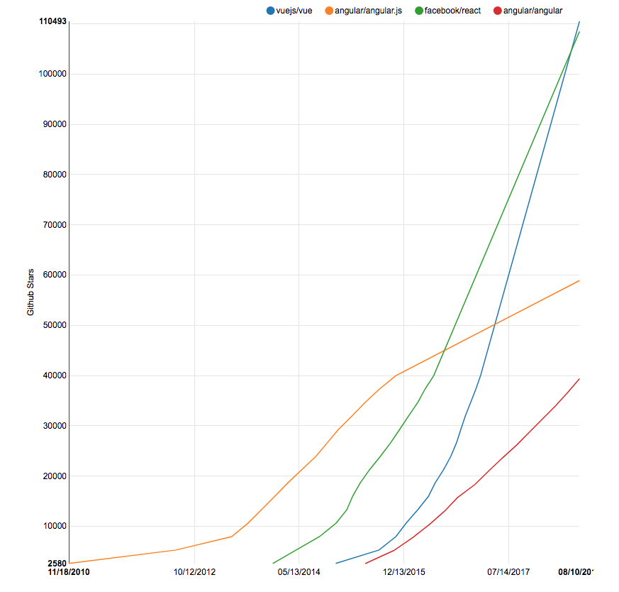
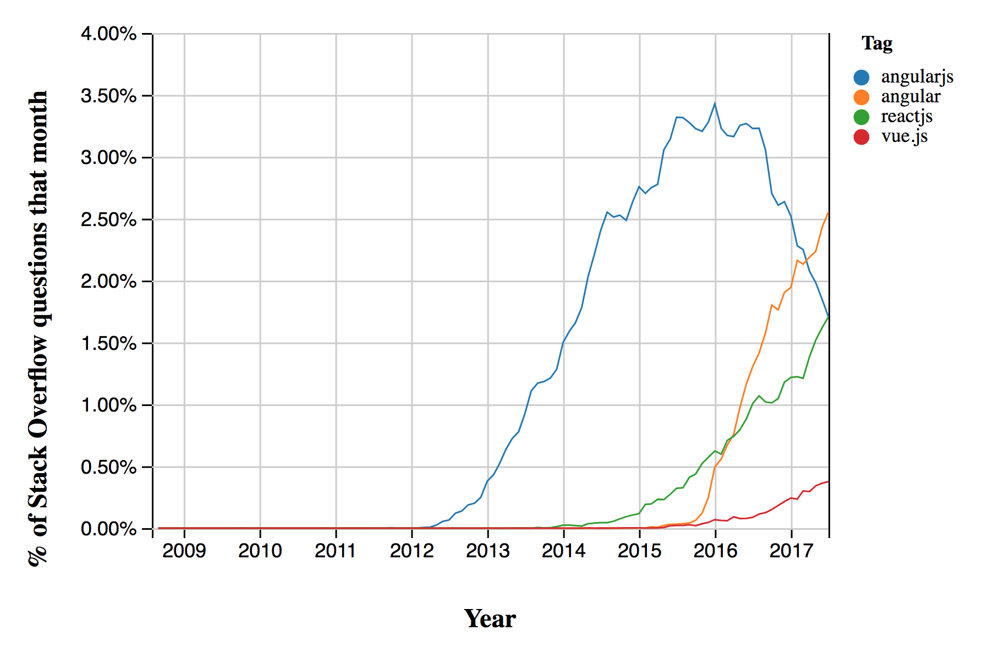

import { Head } from 'mdx-deck'
import { Notes, Image, Appear } from 'mdx-deck'
import { Split, SplitRight } from 'mdx-deck/layouts'
import { FullScreenCode } from 'mdx-deck/layouts'
import { CodeSurfer } from 'mdx-deck-code-surfer'
import nightOwl from 'prism-react-renderer/themes/nightOwl'
// import Appear from './components/Appear'
import { Referer } from './components/Referer'
import { BGImage } from './components/BgImage'

import Layout from './layouts/demo-layout'

export { default as theme } from './theme'

<Head>
  <title>Latest JavaScript Trends 2018</title>
</Head>

# New trends in javascript development (2018)

<br/>


By Peter Cosemans

---


## The Top Trends

<div style={{fontSize: 40, textAlign: 'left'}}>
    <Appear>
        <li>Angular, React & Vue.js</li>
        <li>Javascript Is Still Fastest-growing</li>
        <li>The rize of framework CLI's</li>
        <li>Improve testability with Jest, Storybook & CypressJS</li>
        <li>GraphQL my favorite REST</li>
        <li>Client Side, Server Side and Pre-rendering</li>
        <li>Deployment to Netlify & Serverless</li>
    </Appear>
</div>

---

## The Top Mobile Trends

<br/>
<div style={{fontSize: 60, textAlign: 'left'}}>
    <Appear>
        <li>React Native & Flutter</li>
        <li>PWA</li>
        <li>Web Components</li>
        <li>Ionic 4 & Capacitor</li>
    </Appear>
</div>

---

# Javascript the language

<blockquote>Still getting bigger every year</blockquote>

---

## C# vs JavaScript

&nbsp;

<Referer>Statistics from StackOverflow</Referer>

Javascript Is Still One of the Fastest-growing Languages

---

## Python is Rising


<Referer>Statistics from StackOverflow</Referer>

---

## Expected change in use


---

## Coming soon to JavaScript near you

- Async/Await
- ES Modules for NodeJS
- Class fields (stage-3, TS 1.x)
- Private fields/methods (stage-3, TS 2.5)
- Optional catch binding (stage-3, TS 2.5)
- Dynamic import (stage-3, TS2.4)
- Numeric separators (stage-2, TS2.7)
- Decorators (stage-2, TS1.5)
- Optional chaining (stage-1)

---

## Async/Await

```js
function getAllUsers() {
    return api.get('api/users')
        .then(res => {
            return res.data;
        })
}
```

```js
function async getAllUsers() {
    const res = await api.get('api/users')
    return res.data;
}
```

---

## ES Modules (without webpack)

Native ES Modules in NodeJS (v10)

```js
// lib.mjs
export function add(x, y) { return x + y }

// main.mjs
import { add } from './lib'
```

Loading ES modules in browser

```html
<script scr="lib.mjs" type="module">
```


---

## Class fields
### (ES stage-3, TS 1.x)

```js
class MyClass {
    state = {
        counter: 0
    }
    static propTypes = {
        name: PropTypes.String
    }
}
```

---

## Numeric separators
### (ES stage-2, TS2.7)

```js
const x = 123_234_242;
const y = 123234242;
x === y;    // true
```

---

## Dynamic import
### (ES stage-3, TS2.4)

```js
const moduleSpecifier = './dir/someModule.js';
import(moduleSpecifier)
    .then(someModule => someModule.foo());
```

WebPack can do code splitting on Dynamic imports

---

## Optional catch binding
### (ES stage-3, TS 2.5)

```js
let parseValue = defaultValue;
try {
    parseResult = JSON.parse(val)
}
catch {}
```

---

## Private fields/methods
### (ES stage-3, TS ????)

```js
class MyClass {
    #counter = 0;

    gimmTheCount() {
        this.#inc();
        return this.#coounter;
    }

    #inc() { this.#counter++; }
}
```

---

## Optional chaining
### (stage-1, TS ????)

```js
const x = (foo && foo.bar) ? foo.bar.x : undefined;

const x = foo?.bar?.y
```

---

# JavaScript Frameworks

<blockquote>Battle of the Giants</blockquote>

---

export default Layout

<BGImage src="./images/audiance.jpeg" />

## What framework are you using?

<br/>
<div style={{fontSize: 80, textAlign: 'left'}}>
    <Appear>
        <li>AngularJS</li>
        <li>Angular</li>
        <li>React</li>
        <li>VueJS</li>
        <li>Other (or none)</li>
    </Appear>
</div>

---

## GitHub Stars



---

## Npm Downloads


---

## Usage

&nbsp;
&nbsp;


---

## Use & Intrest


---

## Stack Overflow



---

# Angular

<blockquote>It's just Angular</blockquote>

---

## Angular 6.0

- A new CLI (workspaces, library, schematics, webpack 4, ...)
- RxJS 6.0 (three-shaking)
- Tree-shakable providers
- Consistent versions (cli, material, router, ...)
- Ivy Renderer
- Angular Elements (web components)
- Angular Console

&nbsp;


```notes
- CLI: ng update and ng add (schematics)
```
---

## Angular 6.0 - 7.0

# 😡😡😡

- Breaking & complex CLI
- Breaking changes in RxJS
- Angular Element != Web Components
- Ivy not yet
- Poor Angular Console
- v7: @angular/core split, @aiStore & @angular/mine, breaking compiler

> Is Angular moving away from the JavaScript ecosystem?

```notes
- CLI architecture (Bazel, breaking change, no ng eject, != LernaJS )
- Ivy maybe for v7 (he and it's not compatible)
- not really compatible and where is my `ng eject`
- SystemJS -> WebPack -> Bazel (WTF)
- @angular/core split to 418 modules
- Angular moves away of JavaScript ecosystem
- Artificial intelligence-based storage that is backwards with the ngrx
```

---

# VueJS

<blockquote>Fast and simple</blockquote>

---

## VueJS 2018 - Productivity

- Prettier Vue support
- eslint-plugin-vue (errors in templates)
- vue-test-utils
- Vue Devtools 5.0 (routing & perf tab, editable Vuex state)
- @vue/cli: v3.0 👏

&nbsp;


Is makes you more productive as a VueJS developer

```notes
+ @vue/cli: 3.0 - It's super
    + (plug-ins, web components, ts, jest, cypress)
    + Webpack 4 + customization (merge & chain)
    + modern browser bundle
```

---


---


---

# React

<blockquote>Gives you Wings</blockquote>

---

# 😍 I Love React 😍

Simple button component

```js
import React from 'react'

const Button = (props) => (
    <button className="btn btn-default" {...props}>
        {props.children}
    </button>
)
export default Button
```

---

# vs Angular

(Not So Simple) Button Component

```js
// button.component.ts
import { Component, Input, Ouput } from '@angular/core';

@Component({
    templateUrl: './button.component.html'
})
export class ButtonComponent {
    @Input() type: String;
    @Ouput() click = new EventEmitter();

    handleClick(event) {
        this.click.emit(event)
    }
}
```

```js
// button.component.html
<button class="btn btn-default" [type]="type" (click)="handleClick($event)">
    <ng-content></ng-content>
<button>
```

```js
// my.module.ts
import { NgModule } from '@angular/core'
import { ButtonComponent } from './components/button.component'

@NgModule({
    // ...
    declarations: [
        ButtonComponent
    },
    exports: [
        ButtonComponent
    ]
})
```

---

## React with styles components

```js
import React from 'react';
import styled from 'styled-components';
const Button = styled.button`
  font-size: 1.5em;
  background: transparent;
  color: white;
  border: 2px solid #0099CC;
  border-radius: 6px;
  &:hover {
    color: red;
  }
`;
export default Button
```

 # 😍 😍 😍

---

## vs Vue

```html
<template>
    <button class="btn btn-default" :type="type" @click="$emit($event)">
        <slot></slot>
    <button>
</template>
<script>
export default {
    props: ['type']
}
</script>
```

---

## React 2018

- New core architecture: Fiber (100% backwards compatible)
- Faster Server Side Rendering & streaming
- Fragments & Portals
- Error bounderies
- Context API
- HOC vs render props

## React 2019

- Async rendering & Suspense 😍
- https://build-mbfootjxoo.now.sh/
- https://www.youtube.com/watch?v=6g3g0Q_XVb4


```notes
- Fiber: Reduced File Size
- Improved Error Handling
- Suspense will change (again) the way we write application
```

---

# GraphQL
GraphQL: The next generation of API design

---

## Usage of GraphQL

- Github
- Amazon
- Facebook
- KLM
- PayPal
- AirBnb
- Shopify
- Starbucks
- EggHead
- Kickstarter
- Pintrest
- Medium
- IBM
- Walmart
- American Express
- Sitecore
- Microsoft (and not just because they bought Github)

---

## Solutions of GraphQL

- Headless CMS (GraphCMS, wpgraphql, DataCMS, SiteCore, ...)
- Client libraries (Apollo Client, urql, ...)
- Server libraries (Apollo Server, Yoga, Prisma, ...)
- Managed Services (GraphCool, AWS AppSync)
- Platforms (JS, ruby, java, elixir, dotNet, Python)

 [GraphQL Stack](https://www.graphqlstack.com/)

---

## More productive with GraphQL

[Reducing our Redux code with React Apollo](https://blog.apollographql.com/reducing-our-redux-code-with-react-apollo-5091b9de9c2a)


---

## Apollo Client (no more Redux)


---

## Apollo Client

```js
import gql from 'graphql-tag';
import { graphql } from 'react-apollo';

const GET_DOGS_QUERY = gql`{
    dogs {
        id
        breed
    }
}`;

@graphql(GET_DOGS_QUERY)
const Dogs = ({ onDogSelected, data: { loading, dogs, error } }) => {
  if (loading) return 'Loading...';
  if (error) return `Error! ${error.message}`;
  return (
    <ul>{dogs.map(dog => <li key={dog.id}>{dog.breed}</li>)}</ul>
  );
};
```

---

## Learn Graphqh

### [https://www.howtographql.com/](https://www.howtographql.com/)

---

# Pre-render vs SSR vs CSR
Render what, where, ...?

---

## Client Side Render (CSR)


---

## Server Side Render (SSR)


You need nodeJS on the server to render.

---

## Server Side Render (SSR)

<br/>
<div style={{fontSize: 70, textAlign: 'left'}}>
    <Appear>
        <li>Angular Universal 😥</li>
        <li>Next - React SSR Done Right</li>
        <li>Nuxt - Universal Vue.js Apps</li>
    </Appear>
</div>

---

## Performance matters


---

## www.realdolmen.com

Lighthouse Audit


---

## ordina.be


---

## www.vente-exclusive.com


---

## euri.com ?

---

## euri.com 👏


---

## Pre-rendering

Render the complete site at build time

<br/>
<div style={{fontSize: 60, textAlign: 'left'}}>
    <Appear>
        <li>Jekyll & Hugo</li>
        <li>Gatsby - 🚀 Blazing fast site gen. for React</li>
        <li>VuePress - Vue Static Site Generator</li>
    </Appear>
</div>

---

## Gatsby


---

# Web-Components
The building blocks of the future

```notes
The building blocks
- HTML Templates and slots
- Shadow Dom
- Custom elements (extend HTML)

```

---

## Creating Web Components

<br/>
<div style={{fontSize: 70, textAlign: 'left'}}>
    <Appear>
        <li>(NOT) Angular Elements</li>
        <li>Polymer Library v3</li>
        <li>Ionic Stencil</li>
        <li>VueJS</li>
    </Appear>
</div>

```notes
Ionic v4 is build with Stencil
```

---

## StencilJS

```js
import { Component, Prop } from '@stencil/core';

@Component({
  tag: 'my-first-component',
  styleUrl: 'my-first-component.scss'
})
export class MyComponent {
  @Prop() name: string;
  render() {
    return (
      <p>
        My name is {this.name}
      </p>
    );
  }
}
```

---

## VueJS

Any vue component can be exported as web-component

```bash
# create web-component
vue build ./src/components/Sample.vue --target wc --name my-sample
```

Use

```html
<html>
    <head>
        <title>my-sample demo</title>
        <script src="https://unpkg.com/vue"></script>
        <script src="./my-sample.js"></script>
    </head>
    <body>
        <my-sample prop="hello"></my-sample>
    </body>
</html>
```

---

# Thank You 👋
### [https://mjr-javascript-trends-2018.now.sh/](https://mjr-javascript-trends-2018.now.sh/)

---

### Credits
```jsx
Built with MDX Deck
```
<div style={{ height: 20}}></div>

```jsx
Deployed on now.sh
```
